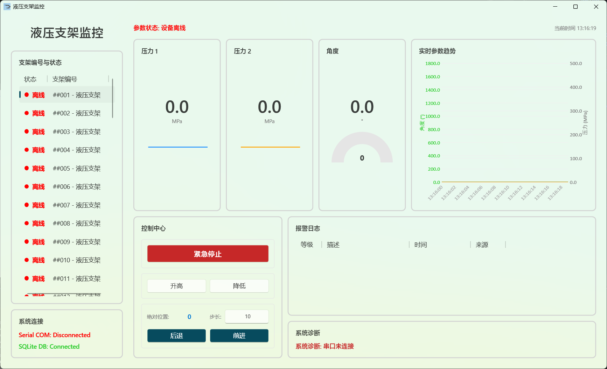
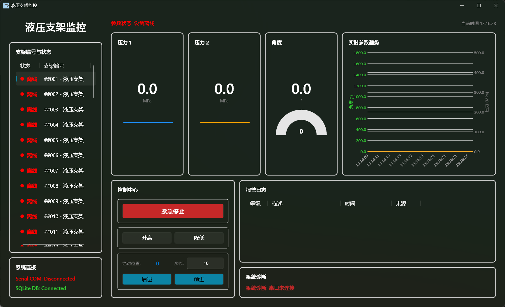

# WPF 液压支架多节点监控系统

本项目是一个基于 WPF (VB.NET) 开发的工业设备监控上位机软件。系统以液压支架为核心监控对象，实现了基于 Modbus RTU 协议的多节点通信、本地 SQLite 时序数据存储以及多通道实时波形渲染。

项目采用标准的 MVVM 架构，在通信层、数据层与表现层实现了良好的解耦，并针对串行总线多节点轮询的常见并发冲突问题，提供了经过验证的底层处理策略。

## ⚙️ 核心技术与架构设计

### 1. 表现层 (UI & Presentation)

- **原生 Fluent Design**：基于 **.NET 10** 框架构建，直接利用系统原生的 Fluent Design 视觉特性。实现了具备现代感（如圆角、微光效果）的工业控制界面。
- **异步渲染机制**：采用 `Task` 异步模型剥离耗时的 I/O 操作（通信与数据库读写），确保主界面 UI 线程的响应连续性。
- **LiveCharts 数据可视化**：集成 LiveCharts 图表库，支持多设备状态切换时的历史波形数据的快速重载与隔离显示。
- **独立坐标状态空间**：在模型层为每一个物理节点分配独立的位置坐标变量，避免多设备切换时的控制参数污染。

### 2. 通信层 (Communication)

- **总线互斥锁 (`SyncLock`)**：针对 RS485 半双工物理特性，在 `ModbusService` 中实现全局互斥锁。确保定时器自动轮询任务与人工操作指令在总线层级的严格排队，避免数据包冲突。
- **零重试轮询策略**：禁用 NModbus4 默认的多次重试机制，配合放宽的单次读取超时时间（150ms），防止单节点离线导致的整体轮询队列阻塞。
- **状态机保护**：利用防重入标志位（IsPolling）控制 DispatcherTimer，避免网络延迟波动引发的轮询任务堆积。

### 3. 数据层 (Persistence)

- **轻量级持久化**：采用 `System.Data.SQLite`，程序启动时自动检测并初始化 `SupportMonitor.db` 本地数据库及历史数据表。
- **后台静默存储**：在 Modbus 轮询线程中，对在线节点的传感数据进行时间戳标记并实时写入数据库，构建底层数据台账。

------

## 📸 界面预览

|  |  |
| --------------------------------------------- | --------------------------------------------- |

------

## 🚀 部署与运行说明

### 环境要求

- 开发环境：Visual Studio 2026 及以上版本。
- 运行环境：Windows 10/11，需安装 .NET 10.0 桌面运行时。

### 仿真测试指南

在脱离实际物理下位机的情况下，可通过以下方式进行逻辑验证：

1. 使用虚拟串口工具（如 Configure Virtual Serial Port Driver）建立一对互通的串口（如 `COM1` <-> `COM2`）。
2. 运行 Modbus Slave 仿真软件，连接至 `COM1`。设置通信协议为 Modbus RTU。
3. 在仿真器中配置 Address 1~4 的输入寄存器（功能码 04）用于模拟传感器读数；配置保持寄存器（功能码 03/06）和线圈（功能码 01/05）用于接收控制指令。
4. 运行本系统，点击界面左下角通信状态栏，选择 `COM2` 并匹配波特率完成连接。

------

## 📂 项目结构导读

- `/Models`：实体模型定义（包含 `SupportModel` 设备状态模型、`AlarmModel` 报警日志模型）。
- `/ViewModels`：系统业务控制中心，核心文件为 `MainViewModel.vb`（包含数据绑定、定时器轮询逻辑与指令路由）。
- `/Services`：底层服务模块。
  - `ModbusService.vb`：串口通信封装与并发控制逻辑。
  - `DatabaseService.vb`：SQLite 数据库连接与 SQL 语句执行。
- `/Views`：XAML 界面定义文件。

------

## 📄 许可证 (License)

本项目采用 [GPL-3.0 License](LICENSE) 协议开源。

允许自由使用、复制、修改及分发本项目代码，但**任何基于本项目的衍生作品（包括修改后的代码或将其引入到其他项目中），都必须同样以 GPL-3.0 协议开源，并公开其完整源代码**。